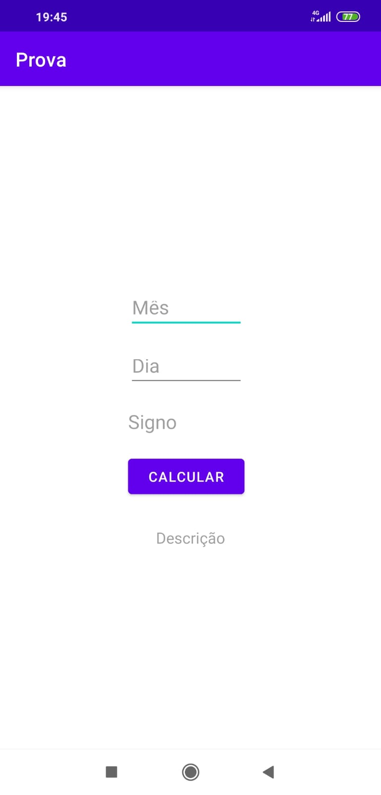
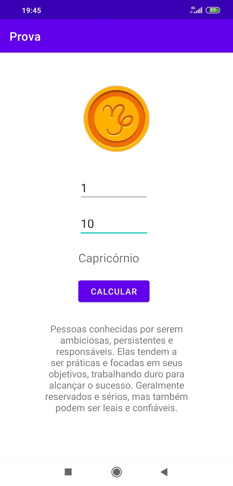

<h1>Calculadora de Signos</h1>

Esse é o projeto Calculadora de Signos, programado em Kotlin por meio do Android Studio. O objetivo deste projeto é poder descobrir o signo de um usuário a partir
do mês e dia de nascimento.

Ao abrir o projeto é possível visualizar duas EditText: "Mês" e "Dia"; duas TextView: "Signo" e "Descrição"; e um botão: "Calcular".

   

      
   

 Ao inserir as informações de dia e mês nas EditText e clicar no botão "Calcular" o programa irá retornar o signo referente e uma pequena descrição sobre o signo designado.

  
